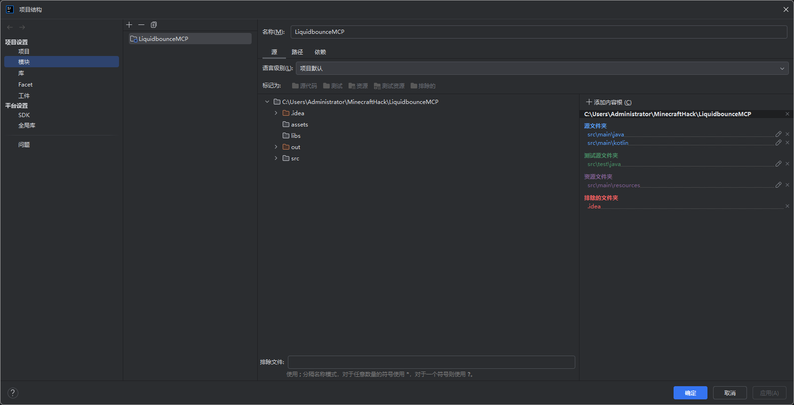
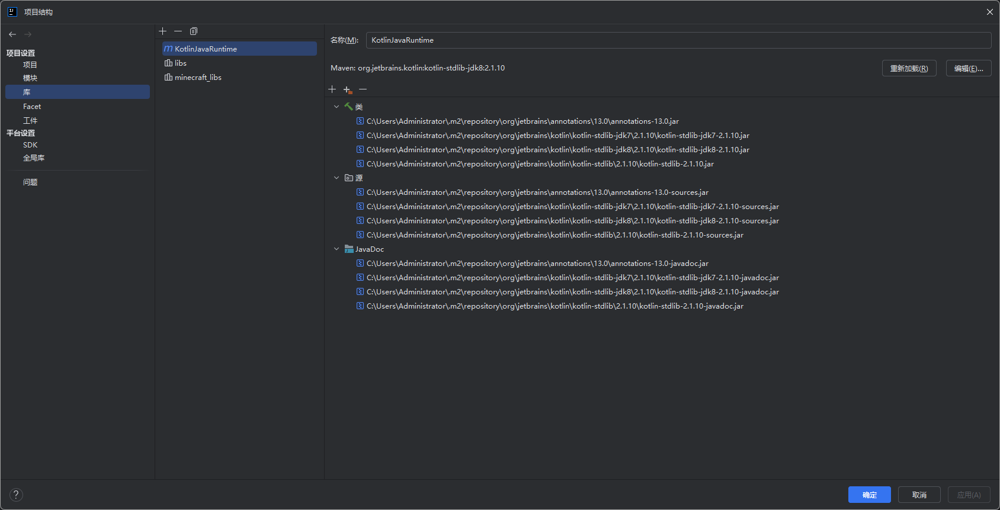
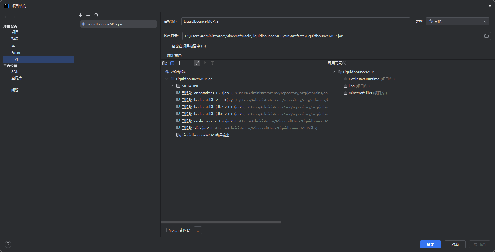
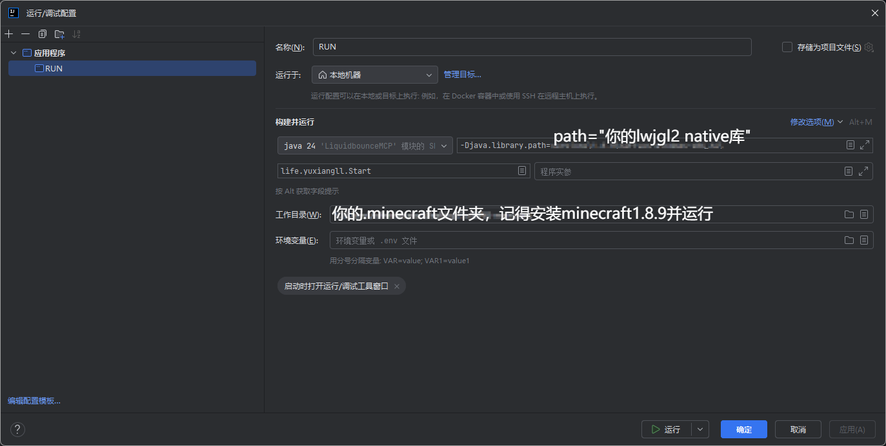

# LiquidbounceMCP

A MCP version Liquidbounce B73 with optifine

using jdk 24


## 配置环境

### 1. 下载代码

```bash
git clone git@github.com:yuxiangll/LiquidbounceMCP.git
```


### 2. 导入IDEA并按照图片设置


设置模块,记得导入kotlin语言
<div align="center">

</div>

设置依赖库

<div align="center">

</div>

(可选)设置构件
<div align="center">

</div>

### 3. 设置运行参数
<div align="center">

</div>

### 4.运行即可启动


Made by yuxiangll,you can use it for everything you want

由yuxiangll制作，你可以用它做任何事

如果由问题，请发布一个issue或者联系我yuxiangll@foxmail.com

Thank you 

open source makes us strong